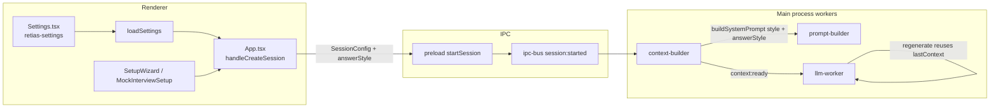

# Answer Style setting

| Files | Purpose |
|---|---|
| `src/components/Settings.tsx` | UI toggle + `loadSettings()` / `retias-settings` persistence |
| `src/App.tsx` | Session start — merge settings into IPC payload (today: `aiModel` only) |
| `src/components/SetupWizard.tsx` | Real Interview setup — per-session `language`, not `answerStyle` |
| `src/components/MockInterviewSetup.tsx` | Mock Interview setup — delegates to `App.handleCreateSession` |
| `electron/ipc-bus.ts` | `SessionConfig` type + `session:started` broadcast |
| `electron/preload.ts` / `src/electron.d.ts` | Renderer ↔ main `SessionConfig` surface |
| `electron/workers/context-builder.ts` | Builds prompts on `question:detected`; holds `sessionConfig` |
| `electron/lib/prompt-builder.ts` | Assembles system prompt from profile + `StyleContext` |
| `electron/lib/context-extractor.ts` | One-time extraction; produces `StyleContext.style_preferences` |
| `electron/workers/llm-worker.ts` | Streams answers; regenerate / manual prompt / screen analysis paths |

## Problem / current behavior

Settings exposes **Answer Style** (`concise` | `detailed` | `bullets`) under **AI & Model**. The choice is saved to `localStorage` key `retias-settings` via `loadSettings()` / `saveSettings()` and defaults to `concise`.

That value is **never read at session start** and **never reaches the main process**. `App.tsx` already merges `loadSettings().aiModel` into interview sessions but omits `answerStyle`:

```typescript
// App.tsx — pattern to extend
setSessionConfig({ ...config, aiModel })
window.electronAPI?.startSession({ /* …fields… */, aiModel })
```

`SessionConfig` (in `electron/ipc-bus.ts`, `electron/preload.ts`, `src/electron.d.ts`) has no `answerStyle` field. Workers never see the preference.

Prompt formatting is instead driven by:

1. **`StyleContext.style_preferences`** — strings extracted once per session from resume/JD/`extraContext` by `context-extractor.ts` (e.g. `"concise, structured bullets, confident tone"`). Cached in SQLite keyed by resume+JD hash; **not** tied to the Settings toggle.
2. **Hard-coded brevity** — `prompt-builder.ts` appends `CRITICAL: Be concise…` and per-question `TYPE_INSTRUCTIONS` with explicit word caps (e.g. behavioral ≤200 words, general ≤120 words).
3. **Legacy fallback** — when extraction is skipped or fails, `context-builder.ts` uses `"Give CONCISE, ACTIONABLE answers. Maximum 5 points."`

Result: changing Answer Style in Settings has **no effect** on generated answers. Users reasonably expect it to control answer length and structure for Real Interview, Mock Interview, and related flows.

**Related orphan:** `responseLanguage` in Settings is also unused at session start; Setup Wizard Step 2 sets its own `language` per session. See [Future work](#future-work-response-language) below.

---

## Proposed behavior

Wire `answerStyle` from Settings into `SessionConfig` at session start. Freeze the value for the session (same as `aiModel`) so mid-session Settings changes do not retroactively alter in-flight prompts. Apply it in `prompt-builder.ts` (structured path) and the legacy fallback in `context-builder.ts`.

### What each option should do

| Setting | User-facing label | Prompt effect |
|---|---|---|
| `concise` | Concise | **Default / current behavior.** Keep existing `TYPE_INSTRUCTIONS` word caps and the `CRITICAL: Be concise…` line. Prefer direct, spoken answers with minimal padding. |
| `detailed` | Detailed | **Relax length constraints.** Replace per-type word caps with guidance to give thorough, well-reasoned answers (roughly 1.5–2× concise length). Keep first-person interview voice. Still answer only what was asked — no unsolicited essays or meta sections. Override the global `Be concise` line with `Provide a complete, well-developed answer with enough detail to demonstrate depth.` |
| `bullets` | Bullet Points | **Structure override.** Require numbered or bulleted points for every answer type (including behavioral STAR and general). Keep content concise per point (1–3 sentences each). Override `TYPE_INSTRUCTIONS` format sections to lead with bullets; tone from `StyleContext` still applies. |

### Separation of concerns: user format vs extracted tone

| Source | Controls | Example |
|---|---|---|
| **User `answerStyle`** (Settings → SessionConfig) | Length and structural format (prose vs bullets vs expanded) | `bullets` → "Use numbered bullet points" |
| **`StyleContext.style_preferences`** (context-extractor) | Tone, voice, lexical constraints from resume/JD/`extraContext` | `"plain language, no buzzwords, confident tone"` |

**Merge rule:** User `answerStyle` **wins on format and length**. Extracted `style_preferences` **win on tone and lexical style**, after filtering out format keywords that conflict with the user choice (e.g. drop `"concise"` / `"structured bullets"` from the extracted list when user chose `detailed` or `bullets`).

Implementation sketch in `prompt-builder.ts`:

```typescript
export type AnswerStyle = 'concise' | 'detailed' | 'bullets'

function mergeStylePreferences(
  extracted: string[],
  userStyle: AnswerStyle
): { toneLine: string; formatBlock: string } {
  // 1. Filter extracted preferences that contradict userStyle
  // 2. Build formatBlock from ANSWER_STYLE_INSTRUCTIONS[userStyle]
  // 3. Join remaining extracted prefs into toneLine (or omit if empty)
}
```

The system prompt should contain **two distinct lines** instead of one ambiguous `Answer Style:` blob:

```
Tone: plain language, confident, no buzzwords.
Format: Use numbered bullet points; 1–3 sentences per point.
```

---

## Data flow



**Session start touchpoints** (all should pass `answerStyle: loadSettings().answerStyle`):

| Entry point | File | Notes |
|---|---|---|
| Real Interview | `App.tsx` → `handleCreateSession` | Primary path |
| Mock Interview | `MockInterviewSetup.tsx` → same handler | No wizard change needed |
| Online Assessment | `App.tsx` → `handleCreateOnlineTest` | See edge cases |
| Solved Assessment browse | `SolvedTestPage.tsx` | Starts `{ testType, aiModel }` only |
| Legacy setup | `Setup.tsx` | Dev/legacy path; include for parity |

---

## API changes

### 1. Shared type

Export a canonical type (avoid duplicating string unions in four places):

```typescript
// Proposed: src/lib/settings-types.ts (or export from Settings.tsx)
export type AnswerStyle = 'concise' | 'detailed' | 'bullets'

export const DEFAULT_ANSWER_STYLE: AnswerStyle = 'concise'

export function normalizeAnswerStyle(value: unknown): AnswerStyle {
  if (value === 'detailed' || value === 'bullets') return value
  return 'concise'
}
```

Tighten `AppSettings.answerStyle` in `Settings.tsx` from `string` to `AnswerStyle`.

### 2. `SessionConfig` field

Add to **all three** definitions (keep in sync):

| File | Change |
|---|---|
| `electron/ipc-bus.ts` | `answerStyle?: 'concise' \| 'detailed' \| 'bullets'` |
| `electron/preload.ts` | Same on inline `SessionConfig` |
| `src/electron.d.ts` | Same on global `SessionConfig` |

Optional: `src/components/SetupWizard.tsx` exports its own `SessionConfig` — add the field there too for type consistency when spreading config in `App.tsx`, even though the wizard does not collect it in UI.

### 3. IPC

No new channel. Existing `session:start` payload grows one optional field. `session:started` listeners (`context-builder`, `llm-worker`, `session-recorder`, `stt-worker`) receive it automatically via the same config object.

### 4. `buildSystemPrompt` signature

```typescript
export function buildSystemPrompt(
  type: QuestionType,
  profile: CandidateProfile,
  job: JobContext,
  company: CompanyContext,
  style: StyleContext,
  options?: {
    language?: string
    extraContext?: string
    answerStyle?: AnswerStyle  // default 'concise'
  }
): string
```

Refactor existing positional `language` / `extraContext` args into `options` **or** append `answerStyle` as the last optional param — match whichever minimizes churn in `context-builder.ts`.

### 5. `context-builder.ts`

- Store `config.answerStyle` from `session:started` (already stores full `sessionConfig`).
- Pass `normalizeAnswerStyle(config?.answerStyle)` into `buildSystemPrompt`.
- Apply the same style block in `buildLegacySystemPrompt` when extraction is unavailable.

### 6. `llm-worker.ts` (optional scope)

Store `sessionAnswerStyle` on `session:started` if screen-analysis or manual-prompt paths need a lightweight suffix without rebuilding full interview context. Prefer a shared helper:

```typescript
// electron/lib/answer-style.ts
export function getAnswerStyleSuffix(style: AnswerStyle): string | null
```

---

## Prompt-builder changes

### New constants

Add `ANSWER_STYLE_FORMAT` and optionally per-type overrides:

```typescript
const ANSWER_STYLE_FORMAT: Record<AnswerStyle, string> = {
  concise: 'Be concise. Answer only what was asked. Do not pad or over-explain.',
  detailed: 'Provide a complete, well-developed answer. Include reasoning, examples, and tradeoffs where relevant. Still stay on-topic.',
  bullets: 'Structure the entire answer as numbered bullet points. Use 1–3 sentences per point. No long prose paragraphs.',
}
```

### `TYPE_INSTRUCTIONS` interaction

| `answerStyle` | Treatment of existing `TYPE_INSTRUCTIONS[type]` |
|---|---|
| `concise` | Unchanged |
| `detailed` | Replace word-cap sentences with "expand each section with concrete detail" variants; keep STAR / architecture scaffolding |
| `bullets` | Replace "4 short points" / "3–4 sentences" with "Use exactly N numbered bullets" mirroring the same semantic sections |

Remove or gate the standalone line `CRITICAL: Be concise…` — it contradicts `detailed` and partially duplicates `concise`.

### Filtering extracted `style_preferences`

When merging, strip tokens that encode format the user explicitly chose otherwise:

| User choice | Filter out from extracted prefs (case-insensitive substring match) |
|---|---|
| `detailed` | `concise`, `brief`, `short` |
| `bullets` | `prose`, `paragraph`, `narrative` |
| `concise` | `detailed`, `comprehensive`, `in-depth` |

Keep preferences like `confident tone`, `plain language`, `no buzzwords` regardless of format choice.

---

## Edge cases

### Real Interview & Mock Interview

**In scope — primary target.** Both flow through `handleCreateSession` → `context-builder` → `prompt-builder`. Mock uses fixed `language: 'English'` and mock-specific `extraContext`; `answerStyle` still comes from Settings.

Changing Answer Style in Settings **after** session start does not affect prompts until a **new** session — document this in Settings UI hint (optional UX follow-up).

### Online Assessment (screen capture)

**Partially in scope.** Screen analysis uses `getScreenAnalysisPrompt(testType)` in `llm-worker.ts`, not `prompt-builder`. Those prompts are tuned for MCQ letters, minimal working, and anti-boilerplate rules.

**Recommendation:**

| `answerStyle` | Online Assessment behavior |
|---|---|
| `concise` | No change (current prompts already optimize for brevity) |
| `detailed` | Append a short suffix: *"When the question allows, include brief reasoning or intermediate steps; do not add sections the question did not ask for."* |
| `bullets` | Append: *"When answering non-MCQ questions, use bullet points. MCQ: still letter + one-line reason only."* |

Do **not** replace `getScreenAnalysisPrompt` wholesale — assessment formats are question-type-driven.

### Manual prompt bar

Uses `lastContext.systemPrompt` when an interview question was answered first; otherwise falls back to screen-analysis or generic prompt.

- **Interview session:** Inherits `answerStyle` baked into `lastContext` — no extra work.
- **Online test with no prior `lastContext`:** Append `getAnswerStyleSuffix(sessionAnswerStyle)` to the fallback system prompt in `answerManualPrompt`.

### Regenerate (`Alt+R` / AnswerPanel ↺)

Replays `lastContext` `{ systemPrompt, userMessage, … }` with cache bypass. Because `systemPrompt` is stored at generation time, regenerate **honors the session-frozen `answerStyle`**. No change needed if prompts are built correctly upstream.

If the user changes Settings mid-session and expects regenerate to pick up the new style — **out of scope**; session-frozen is intentional (matches `aiModel` behavior).

### Screen analysis (single + multi)

Same as Online Assessment. Pass `answerStyle` into `LLMWorker` on `session:started`; apply suffix inside `analyseScreen` / `analyseScreenMulti` when building `systemPrompt`.

### Context extraction cache

Profile cache key (`makeSessionHash`) does **not** include `answerStyle`. Correct — extracted `StyleContext` is input-derived; user format is applied at prompt-build time. No cache invalidation needed when toggling Settings.

### Missing / invalid values

Default to `concise` via `normalizeAnswerStyle`. Legacy `retias-settings` blobs with unknown strings fall back safely.

---

## Future work: response language

Same wiring pattern as `answerStyle`:

| Today | Proposed |
|---|---|
| Settings `responseLanguage` unused | Default for new Real Interview sessions when Setup Wizard language is unset |
| Setup Wizard Step 2 `language` per session | **Overrides** Settings default (session-scoped, like today) |
| Mock Interview hardcodes `'English'` | Could default from Settings |

Implement in a follow-up PR to avoid scope creep. Shared helper: `resolveSessionLanguage(wizardLanguage?, settingsLanguage?)`.

---

## Acceptance criteria

1. With Settings → Answer Style = **Detailed**, starting a Real or Mock Interview produces noticeably longer answers than **Concise** for the same question (same resume/JD/model).
2. With **Bullet Points**, behavioral and technical answers use numbered bullets, not prose paragraphs.
3. Changing Answer Style in Settings **before** starting a new session changes answer format; changing it **during** an active session does not affect the current session's next auto-generated answer (session-frozen).
4. **Regenerate** produces a new answer in the same style as the original (same `answerStyle` embedded in stored `systemPrompt`).
5. Online Assessment screen analysis still returns correct MCQ letter + short justification in **Concise** mode (no regression).
6. Legacy fallback path (no resume/JD) respects `answerStyle`.
7. Invalid/missing `answerStyle` in IPC payload defaults to `concise` without errors.

---

## Test plan

### Manual

| # | Steps | Expected |
|---|---|---|
| 1 | Settings → Detailed. Real Interview with resume+JD. Ask a behavioral question. | STAR-style answer with expanded sections; no `CRITICAL: Be concise` tone |
| 2 | Settings → Bullet Points. Same setup. Ask a technical question. | Numbered bullets, not a prose block |
| 3 | Settings → Concise. Repeat Q1. | Shorter answer vs test 1; matches pre-feature behavior |
| 4 | Start session on Detailed. Switch Settings to Concise **without** ending session. Ask new question. | Still Detailed (session-frozen) |
| 5 | Generate answer → Regenerate. | Same structural style; different wording |
| 6 | Online Assessment → capture → Analyse All on Concise vs Detailed | Detailed adds reasoning where appropriate; MCQ format unchanged |
| 7 | Mock Interview, Bullet Points setting | Bulleted mock answers |
| 8 | Session with empty resume (legacy path) | Style still applied via legacy prompt builder |

### Automated (optional follow-up)

- Unit tests for `mergeStylePreferences` / `normalizeAnswerStyle`.
- Snapshot tests for `buildSystemPrompt` output fragments per `(type, answerStyle)` tuple.

---

## Implementation checklist

Ordered steps for the implementing developer:

1. **Add shared type** — `AnswerStyle`, `normalizeAnswerStyle`, `DEFAULT_ANSWER_STYLE` in `src/lib/settings-types.ts` (or export from `Settings.tsx`).
2. **Tighten Settings** — type `AppSettings.answerStyle` as `AnswerStyle`; optional UI hint: *"Applies to new sessions."*
3. **Extend `SessionConfig`** — `electron/ipc-bus.ts`, `electron/preload.ts`, `src/electron.d.ts`, `SetupWizard.tsx` interface.
4. **Wire renderer session start** — `App.tsx` `handleCreateSession` and `handleCreateOnlineTest`; `SolvedTestPage.tsx`; legacy `Setup.tsx` if still used.
5. **Add `electron/lib/answer-style.ts`** — format blocks, preference filter, optional suffix for screen analysis.
6. **Update `prompt-builder.ts`** — accept `answerStyle`; implement merge logic; adjust `TYPE_INSTRUCTIONS` interaction; remove contradictory global concise line for non-concise modes.
7. **Update `context-builder.ts`** — pass `answerStyle` to `buildSystemPrompt` and legacy builder.
8. **Update `llm-worker.ts`** — store `sessionAnswerStyle` on `session:started`; append suffix in `analyseScreen`, `analyseScreenMulti`, and manual-prompt fallback.
9. **Docs** — update `docs/workers/llm.md` open-ideas bullet; add row to `docs/_conventions.md` `SessionConfig` field list if present.
10. **Verify** — run through manual test plan above; confirm no TypeScript errors across renderer and electron builds.

---

## Open ideas / not yet built

- Per-session Answer Style override in Setup Wizard (advanced users)
- Live preview in Settings showing sample answer formatting
- Unify `responseLanguage` wiring (see [Future work](#future-work-response-language))
- Include `answerStyle` in session recorder metadata for analytics
